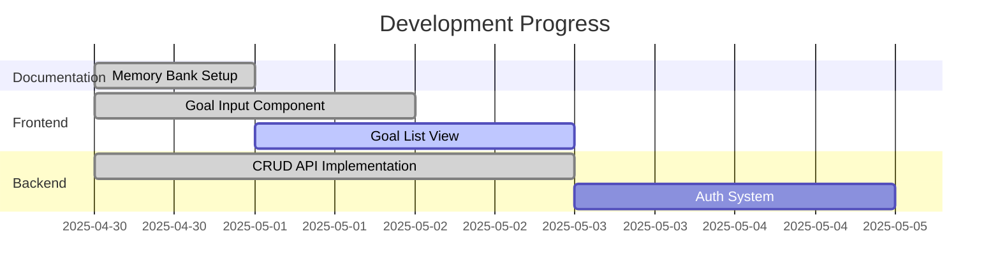

# Active Context: LifeOS

## Current Work Focus

-   Finalizing core Memory Bank documentation structure
-   Implementing initial goal management features
-   Preparing backend API for expanded functionality

## Recent Changes

1. Created foundational Memory Bank documents:
    - projectbrief.md
    - productContext.md
    - systemPatterns.md
    - techContext.md
2. Implemented basic goal creation UI
3. Established serverless backend with DynamoDB integration

## Next Steps

1. Complete remaining Memory Bank files:
    - activeContext.md (this file)
    - progress.md
2. Implement goal visualization features
3. Add psychological framework integrations
4. Develop progress tracking system

## Active Decisions

-   Using Mantine UI for rapid component development
-   AWS Chalice for serverless backend
-   DynamoDB for flexible data modeling
-   Maintaining strict documentation parity with code changes

## Important Patterns

-   Component-based architecture
-   RESTful API design
-   Documentation-driven development
-   TypeScript for type safety

## Progress Tracking

